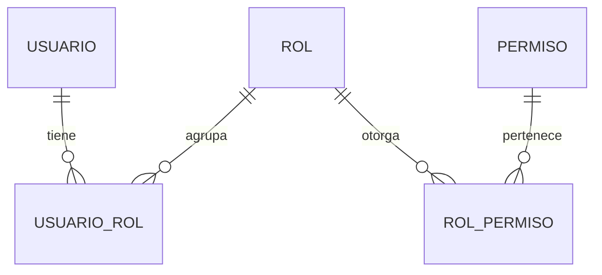

# Modelo de datos: Autenticación de usuarios (Módulo 1)

Fase 1 del plan. Este módulo crea el esquema inicial de la base porque es el primero del sistema.
Sólo incluye los campos que exige la spec del Módulo 1: `Email`, `FechaAlta` y la asociación con
`Persona` son del Módulo 2 y los va a agregar su propia migración (Principio III).

---

## Diagrama de relaciones

Un usuario tiene uno o más roles; un rol otorga uno o más permisos. Los permisos efectivos de un
usuario son la unión de los permisos de todos sus roles vigentes, calculada en cada operación
(FR-006).

---

## Usuario

Cuenta de acceso al sistema. Este módulo la lee para autenticar y sólo escribe `UltimoAcceso`
(FR-005); el alta y la edición son del Módulo 2.

| Campo | Tipo | Nulo | Reglas |
|---|---|---|---|
| `Id` | `int` identity | No | Clave primaria |
| `Username` | `nvarchar(50)` | No | Tal como lo escribió quien creó la cuenta, para mostrarlo |
| `UsernameNormalizado` | `nvarchar(50)` | No | **Índice único**. Espacios recortados y en mayúsculas invariantes. Es el campo por el que se busca al autenticar (FR-012) |
| `PasswordHash` | `nvarchar(200)` | No | Producido por `PasswordHasher`. Nunca sale de la base hacia ninguna respuesta ni log (FR-002, FR-018) |
| `Estado` | `tinyint` | No | `1` Activo, `2` Inactivo, `3` Bloqueado. Sólo `Activo` puede autenticarse (FR-001) |
| `UltimoAcceso` | `datetime2` | Sí | Fecha y hora UTC del último ingreso exitoso. `NULL` si nunca ingresó |
| `PasswordTemporalGeneradaEn` | `datetime2` | Sí | `NULL` = la contraseña es definitiva. Con valor = es temporal y vale 24 horas desde esa marca (FR-017). La escribe el Módulo 2 |

**Reglas de validación al autenticar**

1. Normalizar el username recibido: recortar espacios y pasar a mayúsculas invariantes (FR-012).
2. Buscar por `UsernameNormalizado`. Si no existe, verificar igual contra un hash ficticio y
   responder credenciales inválidas (FR-003 y research §3).
3. Verificar la contraseña contra `PasswordHash`. Si no coincide, credenciales inválidas (FR-003).
4. Si `PasswordTemporalGeneradaEn` tiene valor y pasaron más de 24 horas, credenciales inválidas
   (FR-017).
5. Si `Estado` no es `Activo`, cuenta no habilitada — mensaje distinto (FR-004). **Este control va
   después de verificar la contraseña**: una contraseña incorrecta sobre una cuenta inactiva tiene
   que dar el mensaje genérico, no el de cuenta no habilitada (User Story 4, escenario 3).
6. Con todo en orden: actualizar `UltimoAcceso` y abrir la sesión (FR-005).

**Transiciones de estado**: este módulo no cambia el estado de ninguna cuenta. Las transiciones
`Activo ↔ Inactivo ↔ Bloqueado` son del Módulo 2. FR-016 es explícito: no hay bloqueo automático
por intentos fallidos.

---

## Rol

Agrupación fija de permisos. Este módulo la lee y la siembra; no la crea ni la edita desde ninguna
pantalla.

| Campo | Tipo | Nulo | Reglas |
|---|---|---|---|
| `Id` | `int` identity | No | Clave primaria |
| `Codigo` | `nvarchar(50)` | No | **Índice único**. Identificador estable para el código |
| `Nombre` | `nvarchar(100)` | No | Nombre visible, en español |

---

## Permiso

Autorización concreta sobre una funcionalidad, agrupada por módulo de negocio.

| Campo | Tipo | Nulo | Reglas |
|---|---|---|---|
| `Id` | `int` identity | No | Clave primaria |
| `Codigo` | `nvarchar(100)` | No | **Índice único**. Formato `modulo.accion`, por ejemplo `usuarios.gestionar` |
| `Modulo` | `nvarchar(50)` | No | Módulo de negocio al que pertenece, para agruparlos |
| `Descripcion` | `nvarchar(200)` | No | Texto en español que explica qué habilita |

---

## UsuarioRol

Relación entre usuarios y roles.

| Campo | Tipo | Nulo | Reglas |
|---|---|---|---|
| `UsuarioId` | `int` | No | FK a `Usuario`, borrado en cascada |
| `RolId` | `int` | No | FK a `Rol`, borrado restringido |

Clave primaria compuesta `(UsuarioId, RolId)`. Todo usuario tiene al menos un rol; esa regla la
hace cumplir el Módulo 2, este módulo la asume.

---

## RolPermiso

Relación entre roles y permisos.

| Campo | Tipo | Nulo | Reglas |
|---|---|---|---|
| `RolId` | `int` | No | FK a `Rol`, borrado en cascada |
| `PermisoId` | `int` | No | FK a `Permiso`, borrado en cascada |

Clave primaria compuesta `(RolId, PermisoId)`.

---

## Sesión

**No es una tabla.** El estado de la sesión vive en la cookie cifrada que emite ASP.NET Core; no se
persiste nada en la base (ver research §1). Sus propiedades:

| Propiedad | Valor | Requisito |
|---|---|---|
| Vencimiento por inactividad | 8 horas, deslizante | FR-010 |
| Persistencia | Cookie no persistente: muere al cerrar el navegador | FR-022 |
| Cierre de sesión | `SignOutAsync` borra la cookie de inmediato | FR-013 |
| Revalidación | En cada petición se recargan estado y roles desde la base | FR-006, FR-009 |
| Sesiones simultáneas | Permitidas: cada navegador tiene su propia cookie | FR-014 |
| Atributos de la cookie | `HttpOnly`, `Secure`, `SameSite=Strict` | FR-018 |

---

## Datos iniciales (FR-019)

Los crea una migración de EF Core al instalar el sistema. Son los mínimos para que el sistema sea
operable y para que el Módulo 2 encuentre lo que da por existente.

### Roles

| Código | Nombre |
|---|---|
| `trafico` | Tráfico |
| `administracion` | Administración de la empresa |
| `gerencia` | Gerencia |
| `administrador_sistema` | Administrador del sistema |

### Permisos

| Código | Módulo | Descripción |
|---|---|---|
| `usuarios.gestionar` | Usuarios | Crear, consultar, modificar y dar de baja usuarios y sus roles |

Se siembra sólo este permiso porque es el único que corresponde a una funcionalidad ya
especificada. Cada módulo futuro agrega los suyos con su propia migración (Principio III).

### Asignación de permisos a roles

| Rol | Permisos |
|---|---|
| Administrador del sistema | `usuarios.gestionar` |
| Tráfico, Administración de la empresa, Gerencia | Ninguno todavía |

### Usuario administrador inicial

| Campo | Valor |
|---|---|
| `Username` | `admin` |
| `Estado` | Activo |
| `PasswordHash` | Hash de la variable de entorno `GT_ADMIN_PASSWORD_INICIAL` |
| `UltimoAcceso` | `NULL` |
| `PasswordTemporalGeneradaEn` | `NULL` |
| Roles | Administrador del sistema |

La siembra es **idempotente**: si el usuario `admin` ya existe, no se toca ni se le pisa la
contraseña, y `GT_ADMIN_PASSWORD_INICIAL` deja de ser necesaria. Sólo cuando el usuario no existe la
variable pasa a ser obligatoria: si falta en ese momento, la aplicación no arranca y explica qué
falta (research §6).

No se crea ninguna otra cuenta, ni de ejemplo ni de prueba (FR-019).

---

## Lo que agrega el Módulo 2

Anotado para que la migración del Módulo 2 sepa qué extiende, no para construirlo ahora:

- `Usuario.Email` y `Usuario.EmailNormalizado` (único), `Usuario.FechaAlta`, `Usuario.PersonaId`.
- Tabla `Persona`, con la restricción de una persona asociada a un único usuario.
